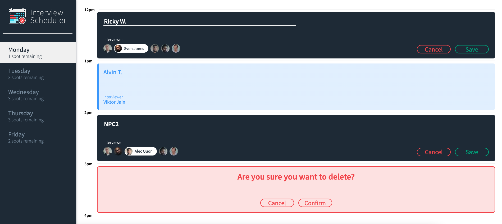
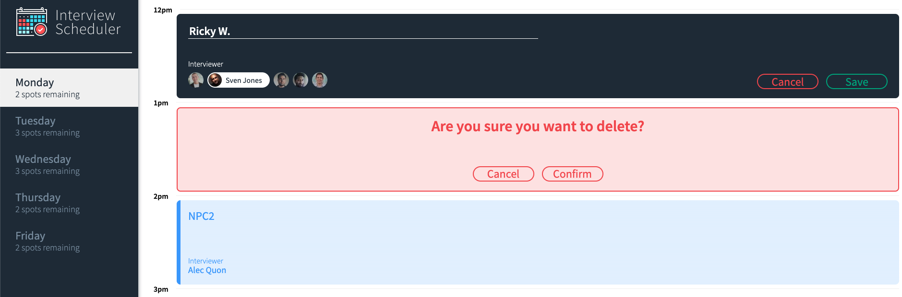
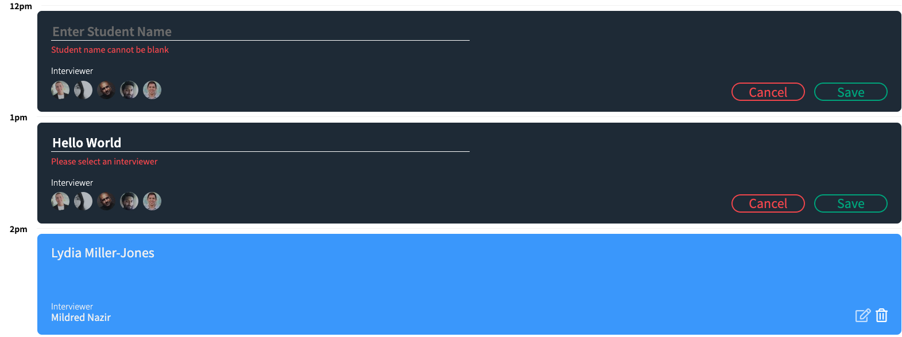

# Interview Scheduler

A fun cool way to keep track of all your student interviews and their seleted interviewer. Interview Scheduler is entirely built with React and Node 
to allow users to easily create appointments, edit, and cancel their appointments. Never get lost scheduling appointments ever again!

## Final Product Screenshots

### Scheduler - Main Layout


### Scheduler - Edit/Delete


### Scheduler - Required Input Fields


## Features
- Users can select the day and time of the week to book their interview
- Users can create, edit and cancel their interview appointments after choosing the day of the week

## Testing Methodology
- React components tested with Storybook
- Helper functions and hooks tested with Jest Test Framework
- End-to-end testing with Cypress Testing Framework


## Setup

- Install dependencies with `npm install`.
- Clone the Api server on: https://github.com/lighthouse-labs/scheduler-api and follow README

## Running Webpack Development Server

```sh
npm start
```

## Running Jest Test Framework

```sh
npm test
```

## Running Storybook Visual Testbed

```sh
npm run storybook
```

## Dependencies 

- Axios
- Classnames
- Normalize.css
- React
- React-dom
- React-scripts
- Babel/core
- Storybook/addon-actions
- Storybook/addon-backgrounds
- Storybook/addon-links
- Storybook/addons
- Storybook/react
- Testing-library/jest-dom
- Testing-library/react
- Testing-library/react-hooks
- Babel-loader
- Node-sass
- Prop-types
- React-test-renderer
